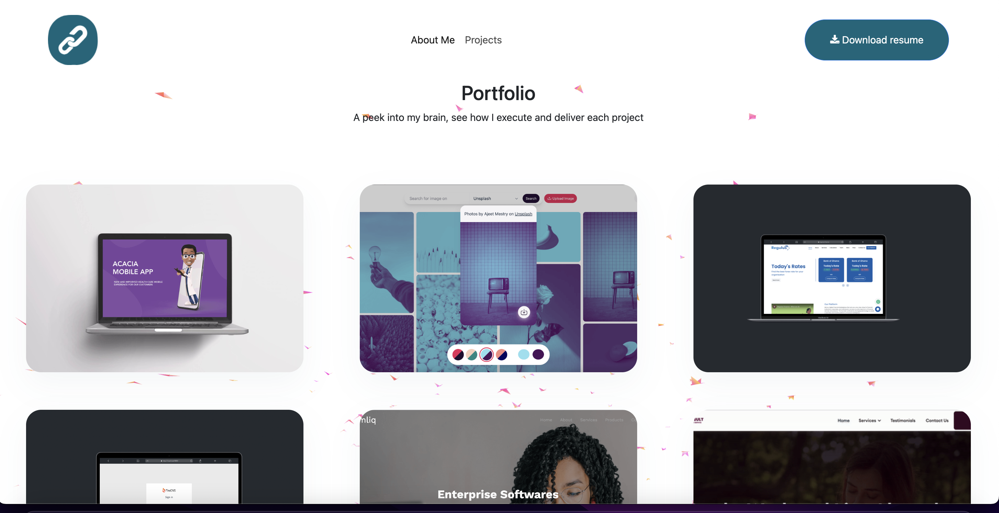

# Welcome to my Portfolio Website!


This repository serves as a showcase of my skills and projects as a Front-End Software Engineer. It encompasses my experience in developing innovative web and mobile applications using JavaScript, React, Vue, and other modern frameworks.

Through this portfolio, you'll get a glimpse into my expertise in collaborating with cross-functional teams, driving project success, and delivering high-quality solutions. I am passionate about staying up-to-date with the latest industry trends and continuously expanding my knowledge.

Feel free to explore the projects and code samples included here to gain insights into my problem-solving approach, attention to detail, and dedication to creating exceptional user experiences.

If you have any questions or would like to discuss potential collaborations, please don't hesitate to reach out. Thank you for visiting my portfolio!
## Project setup

```
npm install
```

### Compiles and hot-reloads for development

```
npm run serve
```

### Compiles and minifies for production

```
npm run build
```

### Lints and fixes files

```
npm run lint
```

### Customize configuration

See [Configuration Reference](https://cli.vuejs.org/config/).
